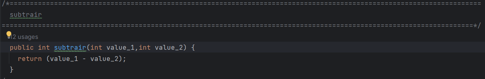

# Calculadora - Qualidade e Teste de Software com o auxílio da JUnit 5
### Última Atualização: 2023-09-11

## Descrição 
Esse projeto consiste na exemplicação de um modelo de teste de software sobre os métodos estipulados para uma calculadora feito em Java, em que é exemplificado a simulação simples das operações bases da matemática, adição, substração, divisão e multiplicação. A partir disto, foi criado diversos cenários para diferentes equações para identificar o comportamento da aplicação e exemplificando a maneira que um software pode ser testado para devidos ajustes a partir de uma condição estipulada, no caso deste, a condição é sempre receber 2 parâmetros e realizar a operação.

## Estrutura 
O repositório está divididos em pastas, as quais apresentam uma funcionalidade específica dentro da composição da Calculadora.

1. `Calculadora/lib`: São os ficheiros compactados do FrameWork JUnit (Ferramentas que auxiliam nos testes automatizados para identificar possíveis falhas nas escrituras dos códigos)
   
2. `Calculadora/src`: Localização das classes principais do repositório:
   - Calculadora: É uma classe pública para pode ser acessada por outros scripts. Nesta está localizado os métodos abaixo:
      1. `somar`: Recebe dois parâmetros inteiros, efetua a adição e retorna o resultado. .
      2. `subtrair`: Recebe dois parâmetros inteiros, efetua a subtração e retorna o resultado. .
      3. `dividir`: Recebe dois parâmetros decimais(<em>double</em>), efetua a divisão e retorna o resultado. .
      4. `multiplicar`: Recebe dois parâmetros decimais(<em>double</em>), efetua a multiplicação e retorna o resultado. .

   - CalculadoraTeste: Script em que é executado cenários de testes para cada método, em alguns casos forçando erros e atribuindo possíveis melhorias para que o problema seja explicado e mostrado diversas correções
   - CalculadoraTesteJUnit: Script em que é executado cenários de testes para cada método, com o auxílio do FrameWork JUnit utilizando o método `assertEquals` cujo recebe dois parâmetros, o resultado esperado e o método passado, retornando o teste como válido ou não, em caso de negativa, ele explica o motivo do erro ocasionado.

## Testes
Os testes foram divididos em duas partes, o teste manual, caracterizado por criar situações de exemplos e executar o código para verificar o resultado da operação, e o teste automatizado, neste caso utilizado a biblioteca JUnit 5. 

- Manual: Foram criados entre 6 a 9 cenários para cada operação, passando diversos tipos de parâmetros, entre eles, positivos inteiros, positivos negativos, float inteiros e negativos, char e string. E após a execução do Script anotado e comentado cada cenário na própria classe, que pode ser obtida em `Calculadora/src/CalculadoraTeste.java`.
- Automatizado: Foram criados os mesmos cenários dos testes manual, porém foi utilizado nomenclatura de métodos diferentes e maneiras de execução distintas, neste contamos com o auxílio da biblioteca `org.junit.jupiter.api.Assertions.assertEquals` e passamos os parametros para identificar os resultados. .

# Changelog 2023-03-11

1. Implementação da documentação respeitando a documentação da estrutura do Javadoc, onde as tags como:
    1. `author`: Indentificação do autor
    2. `version`: Identificação da versão 
    3. `param`: Nome dos parametros e seus retornos.
2. A implementação acima pode ser encontrada nas classes principais em `src/Calculadora.js`, além disso, pode ser melhor analisadas no arquivo html gerado na pasta doc, que contou com auxilio da geração automática da ferramenta Javadoc.

